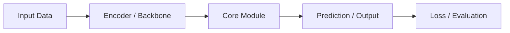

# Prompt 正文

请通读我上传的论文 PDF，并以“研究者视角”进行系统化分析。

输出要求：

1. 使用中文，逻辑清晰，避免空话和纯复述。
2. 优先依据论文 PDF 本身；如需要确认 venue、代码、项目主页，可结合 arXiv、OpenReview、会议/期刊 proceedings、作者主页等公开信息。
3. 不要根据标题、作者名或论文风格主观猜测发表 venue。无法确认时写：`论文中未明确说明 / 当前无法确认`。
4. 必要时保留英文术语，尤其是模块名、指标名、数据集名、会议名、期刊名、机构名。
5. 每个关键判断请尽量区分：
   - 【论文明确说明】：论文中直接给出的内容；
   - 【合理推断】：根据方法、实验或上下文推断，但论文没有直接说明；
   - 【我的评价】：基于研究者视角的判断。
6. 分析重点不是“论文写了什么”，而是解释：
   - 作者到底提出了什么问题；
   - 之前方法没有解决什么；
   - 当前方法如何解决；
   - 实验证据是否真的支持作者结论；
   - 这篇论文仍然没有解决什么；
   - 对我自己的研究有什么参考价值。

---

# 0. 论文基本信息与类型判断

## 0.1 基本信息表

请用表格给出：

| 项目 | 内容 |
| --- | --- |
| 论文标题 | 论文完整标题 |
| 作者 | 按论文顺序列出主要作者 |
| 作者单位 | 学校 / 公司 / 研究机构 |
| 第一作者 | 如能确认则说明 |
| 通讯作者 | 如论文标注则说明；未标注写“论文未明确说明” |
| 论文出处 | 会议 / 期刊 / arXiv / workshop / technical report |
| 发表年份 | 年份 |
| 论文版本 | arXiv v1/v2/v3，或 conference/journal version |
| 论文链接 | arXiv / OpenReview / proceedings / DOI |
| 代码链接 | GitHub / project page；没有则写“论文未提供” |
| 项目主页 | 如有则列出；没有则写“论文未提供” |

## 0.2 Venue 与可信度

请判断：

- 是否为顶级会议 / 顶级期刊 / workshop / arXiv 预印本 / technical report；
- 如果是会议或期刊，请写出全称；
- 如果只是 arXiv，请明确提醒：`当前只能确认是 arXiv 预印本，不能直接视为正式发表论文`；
- 作者团队来自学术界、工业界还是产学合作；
- 论文结论是否已经经过同行评审。

## 0.3 论文类型判断

请判断这篇论文主要属于哪类工作，并说明理由：

| 类型 | 是否属于 | 判断依据 |
| --- | --- | --- |
| 新任务定义 | 是 / 否 / 部分 | 任务、输入输出、评价协议是否新 |
| 新模型结构 | 是 / 否 / 部分 | 是否提出新的 architecture/module |
| 新训练方法 | 是 / 否 / 部分 | 是否提出新的 loss、训练阶段、优化策略 |
| 新数据集 / Benchmark | 是 / 否 / 部分 | 是否贡献数据集、评测协议或指标 |
| 新推理策略 | 是 / 否 / 部分 | 是否改变测试时流程、搜索、采样、后处理 |
| 工程系统优化 | 是 / 否 / 部分 | 是否主要提升效率、部署、吞吐或成本 |
| 分析型论文 | 是 / 否 / 部分 | 是否主要解释现象、做机制分析或诊断 |

最后用一句话概括：

> 这篇论文本质上是一篇“什么类型”的论文，它的主要贡献落在什么层面。

---

# 1. 核心问题与论文目标

## 1.1 研究问题

请说明：

- 论文所属方向，例如 CV / NLP / 多模态 / Diffusion / Representation Learning / Embodied AI 等；
- 任务定义是什么；
- 输入和输出分别是什么；
- 该问题为什么重要；
- 当前领域的核心困难是什么。

## 1.2 一句话总结

用一句话概括：

> 作者希望通过什么方法，解决什么问题，并相较已有方法改进了什么。

要求具体，不要写成宽泛口号。

---

# 2. 之前方法没有解决什么，以及本文如何解决

这是全文最重要部分之一。请不要只写“性能不足”，而要分析结构性问题。

## 2.1 现有方法的问题

请回答：

- 之前方法的核心假设是什么？
- 它们为什么在这个任务上不够好？
- 问题来自数据、模型、训练目标、推理过程、对齐方式、表示能力、计算成本还是泛化能力？
- 作者是否充分证明了这些问题真实存在？如果证据不足，请指出。

## 2.2 问题—方案—证据对应表

请用表格总结：

| 之前方法未解决的问题 | 为什么难解决 | 本文对应设计 | 为什么可能有效 | 论文中的证据 | 仍然可能存在的缺口 |
| --- | --- | --- | --- | --- | --- |
| 问题 1 | 本质难点 | 模块 / loss / 数据 / 流程 | 机制解释 | 主实验 / 消融 / 可视化 | 未验证或仍有风险 |
| 问题 2 | 本质难点 | 模块 / loss / 数据 / 流程 | 机制解释 | 主实验 / 消融 / 可视化 | 未验证或仍有风险 |

## 2.3 核心思想

请解释：

- 作者观察到了什么关键现象；
- 基于什么直觉提出方法；
- 这个思想和前人工作的本质差异是什么；
- 如果这个思想不成立，方法可能在哪些场景失效。

---

# 3. 方法 Pipeline 与框架图

## 3.1 整体流程图

请画出论文方法的 pipeline。优先使用 Mermaid flowchart；如果 Mermaid 不适合，请使用 ASCII 图。

要求：

1. 图中必须包含输入、关键模块、训练信号 / loss、输出。
2. 如果训练和推理流程不同，请分别画两个图。
3. 不要只画模块名，要体现数据如何流动。
4. 图后必须用文字解释每个箭头代表什么。

Mermaid 示例格式：

## 3.2 步骤化解释

请按以下格式说明：

> 步骤 1：输入是什么  
> 步骤 2：经过哪些模块  
> 步骤 3：产生什么中间表示  
> 步骤 4：如何计算训练信号或推理结果  
> 步骤 5：最终输出是什么

如果论文有多个阶段，例如 pretraining / finetuning / alignment / distillation / inference，请分阶段说明。

---

# 4. 核心模块、创新点与优化目标

## 4.1 核心模块拆解

只分析真正影响方法效果的关键模块，不要平均用力。

| 模块名称 | 输入 | 输出 | 功能 | 为什么需要 | 不加会怎样 | 与其他模块关系 |
| --- | --- | --- | --- | --- | --- | --- |

## 4.2 创新点排序

列出 3–5 个最核心创新，按重要性排序。

| 创新点 | 以前怎么做 | 本文改了什么 | 解决什么问题 | 为什么有效 | 实验证据 |
| --- | --- | --- | --- | --- | --- |

要求：

- 每个创新都要对应第 2 节中的具体问题；
- 如果创新只是工程组合或已有方法迁移，请明确说明；
- 如果贡献被论文过度包装，也请指出。

## 4.3 Loss / Objective / 训练目标

如果论文包含关键公式或训练目标，请说明：

- 使用了哪些 loss；
- 每个 loss 的数学形式和变量含义；
- 每个 loss 约束模型什么行为；
- 不同 loss 是否对应不同问题；
- 权重如何设置；
- 哪些模块更新，哪些模块冻结；
- 如果论文没有说明实现细节，请明确写“论文未说明”。

---

# 5. 训练与推理例子

请构造一个“简化但忠实于论文方法”的具体例子，帮助理解方法如何实际运行。

## 5.1 训练阶段例子

| 步骤 | 说明 |
| --- | --- |
| 输入样本 | 具体输入是什么，例如图像、文本、点云、视频、特征或候选类别 |
| 模块处理 | 样本依次经过哪些模块 |
| 中间表示 | 关键模块产生什么表示 |
| 监督信号 / 伪标签 | 训练信号从哪里来 |
| Loss 计算 | 哪些 loss 被计算，分别约束什么 |
| 参数更新 | 哪些模块被更新，哪些被冻结 |
| 学到的能力 | 这个样本帮助模型学到什么 |

## 5.2 推理阶段例子

| 步骤 | 说明 |
| --- | --- |
| 输入 | 推理时给模型什么 |
| 前向传播 | 输入如何经过各模块 |
| 决策过程 | 如何得到最终预测 |
| 输出 | 最终输出是什么 |
| 额外依赖 | 是否需要 prompt、候选类别、检索库、memory、后处理等 |
| 推理成本 | 成本主要来自哪里 |

## 5.3 训练与推理差异

用一句话总结：

> 训练阶段模型通过什么信号学习什么能力；推理阶段模型如何利用这种能力完成任务。

---

# 6. 实验分析：证据是否支持结论

## 6.1 实验设置

请总结：

- 数据集；
- 指标；
- baseline；
- backbone / 模型规模；
- 训练配置中的关键部分；
- 是否使用额外数据或预训练；
- 不同 setting；
- 对比是否公平。

## 6.2 核心结果表

请整理主要结果：

| 方法 | 数据集 | 指标 1 | 指标 2 | 指标 3 | 相比最佳 baseline | 备注 |
| --- | --- | --- | --- | --- | --- | --- |

并分析：

- 哪些指标提升最明显；
- 哪些场景效果不好；
- 是否只在特定 benchmark 上有效；
- 是否存在提升很小但论文过度强调的情况。

## 6.3 消融与诊断实验

请重点分析：

- 每个模块是否真的有效；
- 去掉后性能下降多少；
- 哪个模块贡献最大；
- 哪些设计作用有限；
- 是否缺少关键消融；
- 可视化、失败案例或泛化实验是否支持作者解释。

最后回答：

> 实验结果是否真正支持作者的核心 claim？

---

# 7. 方法为什么有效，以及论文没有解决什么

## 7.1 方法有效机制

请从机制层面分析方法有效的原因。可以从以下角度判断：

- 特征表达是否更强；
- 对齐是否更稳定；
- 训练信号是否更密集；
- 数据质量是否更好；
- 结构先验是否更合理；
- 优化是否更容易；
- 推理流程是否更有效；
- 是否只是工程 trick；
- 换数据集、backbone 或任务后是否仍可能有效。

## 7.2 这篇论文没有解决什么

请单独列出 3–6 条本文仍未解决的问题。

| 未解决问题 | 具体表现 | 为什么重要 | 论文是否承认 | 可能的后续方向 |
| --- | --- | --- | --- | --- |

必须考虑：

- 计算量 / 显存 / 推理速度；
- 数据依赖或标注成本；
- 泛化限制；
- 训练稳定性；
- 超参数敏感；
- hidden assumption；
- 不公平对比；
- 缺少失败案例；
- 缺少真实应用验证；
- 是否只在特定 setting 有效。

---

# 8. 对我的研究方向的关系

请结合我的方向进行分析：

> 我的方向主要关注 unpaired / unsupervised learning、feature space alignment、patch-level / token-level / prototype-level 表示，以及 CLIP-V → DINOv2 patch alignment / UnpairTrans。

请回答：

| 问题 | 分析 |
| --- | --- |
| 是否涉及 unpaired / unsupervised learning | 说明是否相关 |
| 是否涉及 feature space alignment | 说明 alignment 发生在哪个空间 |
| 是否使用 patch/token/prototype 表示 | 说明粒度 |
| 是否可迁移到 CLIP-V → DINOv2 | 说明可迁移与不可迁移部分 |
| 是否适合作为 baseline | 说明如何改造成 baseline |
| 可借鉴思想 | 方法、loss、数据构造、评估协议、可视化 |
| 可作为我创新点的缺口 | 论文没解决但我的方向可能解决的问题 |

最后给出：

> 这篇论文对 UnpairTrans 最大的启发是什么？最大的警示是什么？

---

# 9. 综合评价

请用表格评价：

| 维度 | 评价 | 理由 |
| --- | --- | --- |
| 创新性 | 高 / 中 / 低 | 说明理由 |
| 技术难度 | 高 / 中 / 低 | 说明理由 |
| 实验可信度 | 强 / 中 / 弱 | 说明理由 |
| 工程价值 | 高 / 中 / 低 | 说明理由 |
| 学术影响潜力 | 高 / 中 / 低 | 说明理由 |
| 复现难度 | 高 / 中 / 低 | 说明理由 |
| 方法通用性 | 高 / 中 / 低 | 说明理由 |

最后用 5 句话总结：

1. 这篇论文最强的地方是什么；
2. 最弱的地方是什么；
3. 它是否真正推动了领域，还是主要是工程组合 / 实验技巧；
4. 它最值得借鉴的部分是什么；
5. 它对我自己的研究有什么具体参考价值。